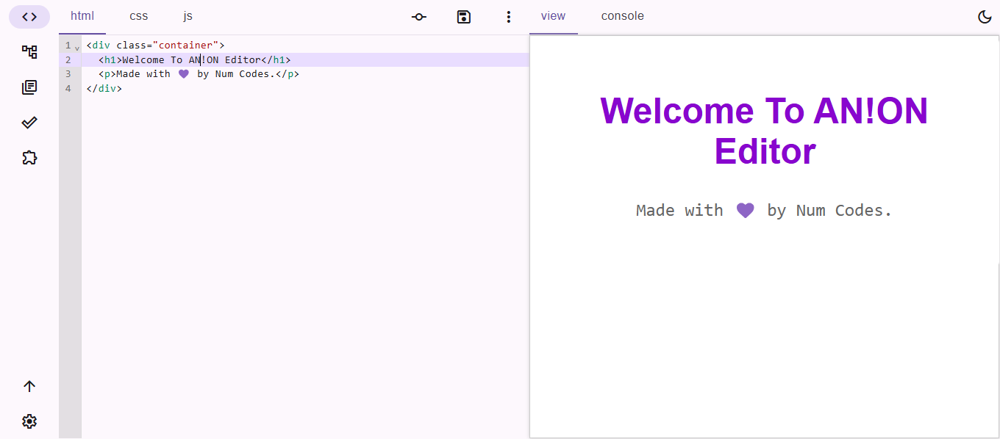
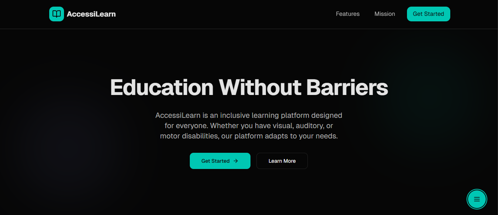

# Num Codes Personal Portfolio

This project is a personal portfolio website built to showcase my work, skills, and experience as a developer. It's designed to give visitors a clear, engaging, and comprehensive look at my projects, technical abilities, and professional journey, making it easy to see what I'm all about and how I can contribute.

## Usage

This portfolio is straightforward to navigate and explore.

When you land on the **Home** page, you'll get a quick introduction to my background and a glimpse of my latest blog posts.

Dive into the **About** section to learn more about my professional journey, work experience, studies, and technical skills. You'll find a detailed breakdown of my expertise.

The **Work** section is where you can see my projects in action. Each project has a dedicated page with more details, a summary, and links to live demos or case studies.

If you're curious about my creative side, the **Gallery** offers a visual showcase of various designs and product screens.

I've also integrated my **GitHub** profile, so you can check out my latest repositories, including pinned highlights and other contributions.

There's a **Theme Toggle** button in the header that lets you switch between light and dark modes, ensuring a comfortable viewing experience no matter your preference.

To run the project locally, you'll need Node.js and npm (or yarn/pnpm) installed.

1.  Clone the repository:
    ```bash
    git clone https://github.com/numcodes/portfolio-v3.git
    cd portfolio-v3
    ```
2.  Install dependencies:
    ```bash
    npm install
    # or yarn install
    # or pnpm install
    ```
3.  Start the development server:
    ```bash
    npm run dev
    # or yarn dev
    # or pnpm dev
    ```
    The site will be available at `http://localhost:3000`.

### Screenshots

Here are a couple of examples of what you'll see on the portfolio:

#### An!on Editor Project Showcase


#### AccessiLearn Project Showcase


## Features

*   **Project Showcase**: Dedicated pages for each project with detailed descriptions, images, and links to live applications or case studies.
*   **About Section**: Comprehensive overview of my work experience, education, and technical skills, including a dynamic display of languages and social links.
*   **GitHub Integration**: Fetches and displays my latest and highlighted GitHub repositories, providing direct links to the code.
*   **Dynamic OG Image Generation**: Automatically creates Open Graph images for social sharing based on page content, enhancing shareability.
*   **Theme Toggle**: Allows users to switch between light and dark modes for a personalized viewing experience.
*   **Responsive Design**: The website looks great and functions perfectly across all devices, from mobile phones to large desktops.
*   **MDX-Powered Content**: Leverages MDX for rich, maintainable content on project and blog pages, combining Markdown with JSX.
*   **Route Protection**: Specific routes can be password-protected for private content.
*   **SEO Optimized**: Includes sitemap and robots.txt generation, along with structured data (Schema.org) for better search engine visibility.
*   **Mailchimp Integration**: (If enabled) A newsletter signup form is available to keep visitors updated.

## Technologies Used

| Technology         | Description                                     | Link                                            |
| :----------------- | :---------------------------------------------- | :---------------------------------------------- |
| **Next.js**        | React framework for production                  | [Next.js](https://nextjs.org/)                  |
| **React**          | JavaScript library for building user interfaces | [React](https://react.dev/)                     |
| **TypeScript**     | Typed superset of JavaScript                    | [TypeScript](https://www.typescriptlang.org/)   |
| **Once UI System** | Comprehensive UI component library              | [Once UI](https://once-ui.com/)                 |
| **Sass**           | CSS pre-processor                               | [Sass](https://sass-lang.com/)                  |
| **MDX**            | Markdown for JSX                                | [MDX](https://mdxjs.com/)                       |
| **Biome.js**       | Linter and formatter                            | [Biome.js](https://biomejs.dev/)                |
| **Recharts**       | Composable charting library                     | [Recharts](https://recharts.org/en-US/)         |

## Author Info

**Num Codes**
AI Systems Researcher · Full-Stack Developer

*   **Website**: [https://numcodes.vercel.app](https://numcodes.vercel.app)
*   **LinkedIn**: [Your LinkedIn](https://linkedin.com/in/ugochukwu-nweze-08812a2b8)
*   **X (Twitter)**: [@CodesNum80638](https://x.com/CodesNum80638)
*   **GitHub**: [numcodes](https://github.com/numcodes)
*   **Instagram**: [num_codes](https://instagram.com/num_codes)

---
